# 1 Lucene80DocValuesConsumer

用于完成索引文件的落地，*写* dvd、dvm文件。

# 2  文件格式

dvd与dvm 文件存储的是列式的索引信息。

在dvd文件中，按照不同字段分为如下结构：

每个字段就是一个docsIDField 和FielValues的组合，当前段有几个字段就有几种这样的组合。

- DocsIDFileId  记录有当前字段的文档id
- FieldValues  字段的值，FielDValues   结构如下

## 2.1 DocsIDFileId  

DocsIDFileId   存储的是哪些文档有当前字段，记录的是文档id值。

但又分为 3种不同情况

- 所有文档都有当前字段
- 所有文档都没有当前字段
- 部分文档有当前字段

无论全有和全没有。都不需要逐个记录每个id。只需要一个标记位即可。这个标记位就在dvm中。

对于部分有id情况，需要记录每个文档id的值在DocsIDFileId,它的结构为分块结构

- 将每2^16个文档id为一组进行存储，并且在最后面有一个jump结构，用于定位每个block的位置

## 2.2 dvm- DocsIDFileId  部分

dvm是对dvd文件的索引，每个字段都是如下结构。

- offset ：dvd 文件中 DocsIDFileId   结构开始的位置。特殊情况：-2 表示当前字段全为空，-1 表示当前字段全有值
- docIdPointer ： DocsIDFileId    结构所占的空间
- jumpCount ： DocsIDFileId   被分为几个block
- demseRankPower：DocsIDFileId    压缩时用
- numValues ：DocsIDFileId 存储文档数量

通过dvm上面的结构，我们可以轻松的定位到每个字段在dvd文件的位置。

## 3 FieldValues  

FieldValues   结构根据不同的数据类型，保存为不同的结构。其与 `DocValuesWriter`中不同子类一一对应。

# 4 NUMERIC 格式

本文档在 Lucene80DocValuesConsumer 的文档基础上，描述关于NUMERIC 字段类型的`FieldValues`  编码。

## 4.1 FieldValues

这里FieldValues 存储的就是一个数值数组，但为了尽可能的提高压缩率，需要确保保存的数据尽可能的小，这样才可以通过类似 `PackedInts` 的方式减少存储空间。所以采取以下方式：

- 所有数据存储的都是与最小值的差值
- 除了存储差值，还除以这些数值的最大公约数，以减小其数值
- 为可使最大公约数尽可能的大，可能采取分块的方式，这样在局部范围内。才有可能使最大公约数值越大。当然如果分块将减少的比例在0.9以上，则不会被分块。

以上就是对于NUMERIC 格式 的FieldValues。其数据最后为压缩后的数值。我们主要关注点在dvm上，观察dvm。记录哪些信息，方便我们解析FieldValues

## 4.2 dvm- FieldValues  部分

dvm文档除了 DocsIDFileId  部分外，还有描述FieldValues相关字段的索引，具体如下：

- blockCount ： FieldValues 分块数量，如果不分块。则为-1
- numBitsPerValue ： 数组的每个元素，使用几个bit位来存储
- min： FieldValues  的最小值
- gcd ： 最大公约数
- startOffset： FieldValues  开始时在 dvd文档的偏移量
- pointer ： FieldValues   占用dvd文档大小
- jumpOffset ：如果分块，分块索引的偏移量。没有分块为 -1

# 5  BINARY格式

本文档在 Lucene80DocValuesConsumer 的文档基础上，描述关于BINARY字段类型的`FieldValues`  编码。

//TODO 后续查看

# SORTED格式

本文档在 Lucene80DocValuesConsumer 的文档基础上，描述关于SORTED字段类型的`FieldValues`  编码。

# 2 FieldValues

SORTED 为短语格式的索引，它共分为3个数组进行存储

- ord 数组：数量与文档id相同，用于存储每个文档对于的values编号
- values数组：用于存储短语的值，每个元素都是先存储短语长度，后存储值
- address 数组：用于存储每个values数组元素在dvd文件的位置

所有在dvm的文件中，都是围绕这3个数组展开的。

# 3 dvm- FieldValues  部分

- numberOfBitsPerOrd ： 一个ord占用的bit位
- ordStartOffset： ord数组在dvd文件开始位置
- ordPointer： ord数组占用dvd大小
- code： 压缩格式
- blockShift： 分片方式
- maxLength：values中占用最大的长度
- valueStartOffset： value数组在dvd开始位置
- valuePointer： value占用dvd大小
- addressStartOffset：address数组在dvd 文件开始位置
- addressPointer ： address数组在dvd占用大小

