# 1 Lucene80DocValuesConsumer

用于完成索引文件的落地，*写* dvd、dvm文件。

# 2  文件格式

dvd与dvm 文件存储的是列式的索引信息。

在dvd文件中，按照不同字段分为如下结构：

每个字段就是一个docsIDField 和FielValues的组合，当前段有几个字段就有几种这样的组合。

- DocsIDFileId  记录有当前字段的文档id
- FieldValues  字段的值，FielDValues   结构如下

## 2.1 DocsIDFileId  

DocsIDFileId   存储的是哪些文档有当前字段，记录的是文档id值。

但又分为 3种不同情况

- 所有文档都有当前字段
- 所有文档都没有当前字段
- 部分文档有当前字段

无论全有和全没有。都不需要逐个记录每个id。只需要一个标记位即可。这个标记位就在dvm中。

对于部分有id情况，需要记录每个文档id的值在DocsIDFileId,它的结构为分块结构

- 将每2^16个文档id为一组进行存储，并且在最后面有一个jump结构，用于定位每个block的位置

## 2.2 dvm

dvm是对dvd文件的索引，每个字段都是如下4个结构。

- offset ：dvd 文件中 DocsIDFileId   结构开始的位置
- docIdPointer ： DocsIDFileId    结构所占的空间
- jumpCount ： DocsIDFileId   被分为几个block
- demseRankPower：DocsIDFileId    压缩时用。

通过dvm上面的结构，我们可以轻松的定位到每个字段在dvd文件的位置。

## 2.3 FieldValues  

FieldValues   结构根据不同的数据类型，保存为不同的结构。其yu

# 3 